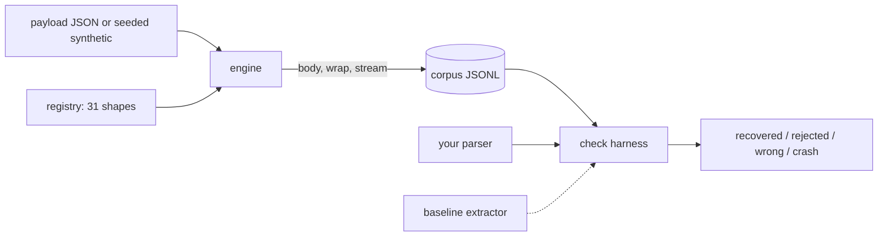

# sloppygen

[English](README.md) | [中文](README.zh.md) | [日本語](README.ja.md)

[](LICENSE) [](CHANGELOG.md) [](pyproject.toml)  [](CONTRIBUTING.md)

**壊れた JSON・はぐれたコードフェンス・漏れ出た思考連鎖——LLM の不正形出力をシードから決定的に生成し、ユーザーより先にパーサのクラッシュを見つけるオープンソースジェネレータ。**


```bash
git clone https://github.com/JaydenCJ/sloppygen && cd sloppygen && pip install -e .
```

> **プレリリース：** sloppygen はまだ PyPI に公開されていません。初回リリースまでは [JaydenCJ/sloppygen](https://github.com/JaydenCJ/sloppygen) をクローンし、リポジトリのルートで `pip install -e .` を実行してください。ランタイム依存ゼロなので `PYTHONPATH=src` でも動きます。

## なぜ sloppygen？

どの LLM アプリにも同じ荷重部品があります：モデル出力をデータに変えるパーサです。そしてそのどれもが、モデルの「調子が良い日」の出力を見て書かれています。やがて本番がやって来ます——閉じられないフェンス、`'シングルクォート'`、漏れ出た `<thinking>` ブロック、文字列の途中で切れた補完——パーサはクラッシュするか、もっと悪いことに、間違ったデータを黙って流します。文法ファザーが投げるランダムなバイト列はモデルの実出力に似ても似つかず、手書きのフィクスチャは既に痛い目を見た失敗しかカバーしません。sloppygen は文書化された 31 種の LLM 失敗形態を、決定的でオフラインなコーパスとして提供します：同じシードなら、どのマシンでも同じバイト列——今週いちばん奇妙だった補完が、来週のリグレッションテストになります。モデルは呼ばず、API キーも不要です。

|  | sloppygen | Hypothesis | Atheris | 手書きフィクスチャ |
|---|---|---|---|---|
| 文書化された LLM 失敗形態を再現 | はい（31 種） | いいえ（型駆動ランダム） | いいえ（カバレッジ誘導のバイト列） | 既に痛い目を見たものだけ |
| シードから決定的なコーパス | はい、バイト単位で一致 | サンプル DB で再生 | コーパス依存 | はい |
| 全サンプルに期待ペイロードを同梱 | はい | 該当なし | いいえ | 手作業で維持 |
| クラッシュだけでなく誤答も捕捉 | はい（crash/wrong/reject の三分類） | 自前のアサーション | いいえ | 自前のアサーション |
| 計装や LLM が必要 | いいえ | いいえ | ネイティブ計装 | あなたが本番ログから貼り付け |
| ランタイム依存 | 0 | 3 | C 拡張 | 0 |

<sub>依存数は 2026-07 時点で PyPI に宣言されたランタイム要件：Hypothesis 6.x（attrs、sortedcontainers、旧 Python では exceptiongroup も）。sloppygen の数は [pyproject.toml](pyproject.toml) の `dependencies = []` です。</sub>

## 特徴

- **文書化された 31 の失敗形態**——フェンス、前置きのおしゃべり、シングルクォート、Python リテラル、末尾カンマ、NaN、文字列途中の切断、繰り返しループ、漏れた `<|im_end|>`、ゼロ幅文字など；それぞれに正直な一行の成因メモ付き（`sloppygen explain <shape>`）。
- **完全シード化・完全オフライン**——各サンプルは `(seed, index, shapes)` の SHA-256 で導出；コーパスはどの実行・どのプラットフォームでもバイト単位で一致し、失敗サンプルは一行のメタデータから正確に再生成できます。モデルなし、API キーなし、ネットワークコードは一切なし。
- **トークン単位の精密な破壊**——body 層の変異は本物の JSON トークナイザを通るため、引用符を替えられるのは必ず文字列トークン、消されるのは必ず構造上のカンマ；各サンプルは主張どおりの欠陥だけを試験します。
- **回復可能か否かを正直に記録**——ラッパーのノイズは突破できて当然；文字列途中の切断はきれいに拒否されるべき。全サンプルのフラグが「抽出せよ」型と「上品に失敗せよ」型のテストを分けます。
- **結果を裁くハーネス**——`sloppygen check` は各サンプルを recovered / rejected / wrong / crash に分類し、静かな誤答を問題として扱い、終了コード 1 で CI に繋がります。任意のサブプロセス（stdin/stdout 契約）にも任意の Python 呼び出し可能オブジェクトにも対応。
- **形態の重ね掛け**——`--stack 2` は body 変異とラッパー文や転送損傷を現実の順序で合成します。現実の失敗は組み合わさって届くからです。
- **超えるべきベースラインを同梱**——`check --baseline` は、どうせあなたが書いたであろう抽出器をベンチマークします。釘付けにされた既知の欠陥（Python の `json.loads` は `NaN` を平然と受け入れる）も含めて。

## クイックスタート

インストール：

```bash
git clone https://github.com/JaydenCJ/sloppygen && cd sloppygen && pip install -e .
```

おしゃべりなモデルがやるようにペイロードを 1 つ破壊——完全に決定的で、シード 7 は常に正確にこれを出します：

```bash
echo '{"city": "Tokyo", "population_m": 37.4}' > city.json
sloppygen gen --shape chatter+trailing_comma --seed 7 --payload city.json
```

```text
{
  "city": "Tokyo",
  "population_m": 37.4,
}

Let me know if you need anything else!
```

次は本来のワークフロー：62 サンプルのコーパスを作り、パーサを走らせます。以下はわざと素朴に書いた抽出器（フェンスで分割、`{`…`}` を切り出し、`json.loads`——白状しましょう、これを本番に出したことがあるはず）がカタログに出会った結果。出力は実行実物で、省略した行は `...` で示します：

```bash
sloppygen corpus --seed 42 --count 62 -o corpus.jsonl
sloppygen check corpus.jsonl --cmd "python3 examples/naive_parser.py"
```

```text
shape                  n  recovered  rejected  wrong  crash
trailing_comma         3          0         0      0      3
missing_comma          3          0         0      0      3
single_quotes          2          0         0      0      2
...
nan_infinity           2          0         0      2      0
...
chatter                2          2         0      0      0
...
totals                62         16         0      2     44

findings: 46 (44 crash, 2 wrong)
  crash  0000-trailing_comma  json.decoder.JSONDecodeError: Expecting value: line 44 column 3 (char 1017)
  crash  0001-missing_comma  json.decoder.JSONDecodeError: Expecting ',' delimiter: line 14 column 7 (char 369)
  ...
```

44 のクラッシュと 2 つの静かな誤答、どれも id から再生成可能。同じハーネスは任意の Python 呼び出し可能オブジェクトも駆動します——pytest に入れれば、カタログ全体が恒久的なリグレッションスイートになります：

```python
import sloppygen

samples = sloppygen.corpus(sloppygen.synthetic_payload(seed=7), count=62, seed=7)
report = sloppygen.evaluate(samples, my_parser)   # raise ValueError = clean reject
assert not report.findings(), report.render()
```

コピペで使える pytest 版は [`examples/pytest_regression.py`](examples/pytest_regression.py)、カタログの完全リファレンスは [`docs/shapes.md`](docs/shapes.md) にあります。

## 形態カタログ

4 カテゴリ全 31 形態；`sloppygen list` が全表を出力し、`sloppygen explain <id>` は成因メモ付きのビフォーアフター実演を表示します。

| カテゴリ | 数 | 例 |
|---|---|---|
| `wrapper` | 9 | markdown フェンス（閉鎖・未閉鎖・二重・誤ラベル）、おしゃべり、XML 風タグ、漏れた思考ブロック |
| `syntax` | 12 | 末尾/欠落カンマ、シングルクォート、無引用キー、Python リテラル、曲がった引用符、コメント、生の改行、NaN、非標準数値、全角句読点 |
| `structure` | 8 | 省略記号プレースホルダ、JSONL 散布、二重エンコード JSON、出力の重複、自己訂正、閉じ括弧の不足、二種類の切断 |
| `noise` | 2 | HTML エンティティ、ゼロ幅文字と BOM |

コーパス生成は少数のオプションで制御します：

| キー | 既定値 | 効果 |
|---|---|---|
| `--seed` | `42` | すべての乱択を決定；同じシードなら同じバイト列 |
| `--count` | `64` | 生成するサンプル数；形態は登録順に一巡してから繰り返す |
| `--payload` | 合成 | 破壊する JSON ファイル（`-` は stdin）；既定の合成ペイロードは配列専用の `jsonl_spray` を除く全形態を有効化 |
| `--stack` | `1` | サンプルあたりの形態数：2 = body + wrap/stream、3 = body + wrap + stream |
| `--shapes` / `--category` | 全部 | カタログを絞り込む |

## 終了コードと check 契約

サブプロセス型パーサは stdin でサンプルを受け取り、stdout に JSON を出して終了コード 0、または終了コード 1 できれいに拒否します；traceback、終了コード ≥ 2、タイムアウト、JSON でない stdout はクラッシュ扱いです。プロセス内パーサは `ValueError` で拒否；それ以外の例外はすべてクラッシュ。誤答は常に問題として数え、きれいな拒否は `--strict` 時のみ、かつ回復可能サンプルに限って数えます。完全な契約は [`docs/corpus-format.md`](docs/corpus-format.md) を参照。

## 検証

このリポジトリは CI を同梱しません；上記の主張はすべてローカル実行で検証されています。このリポジトリのチェックアウトから再現できます：

```bash
pip install -e '.[dev]' && pytest && bash scripts/smoke.sh
```

出力（実行実物からの転載、`...` で省略）：

```text
90 passed in 0.46s
...
[naive] findings: 46 (44 crash, 2 wrong)
SMOKE OK
```

## アーキテクチャ



## ロードマップ

- [x] 31 形態のカタログ、トークン単位エンジン、シード化コーパス、重ね掛け、check ハーネス、ベースライン抽出器、CLI（v0.1.0）
- [ ] PyPI 公開、`pip install sloppygen` 対応
- [ ] 意味ドリフト形態（キーの大文字小文字ドリフト、単位の入れ替え）と対応する期待ペイロード調整
- [ ] ストリーミングコーパスモード：増分パーサ向けにサンプルをチャンク列で出力
- [ ] ユーザー提供の JSON Schema からスキーマ対応の合成ペイロードを生成

完全なリストは [open issues](https://github.com/JaydenCJ/sloppygen/issues) を参照してください。

## コントリビュート

貢献を歓迎します——まずは [good first issue](https://github.com/JaydenCJ/sloppygen/issues?q=is%3Aissue+is%3Aopen+label%3A%22good+first+issue%22) から、あるいは [discussion](https://github.com/JaydenCJ/sloppygen/discussions) を立ててください。開発環境の構築は [CONTRIBUTING.md](CONTRIBUTING.md) を参照。

## ライセンス

[MIT](LICENSE)
