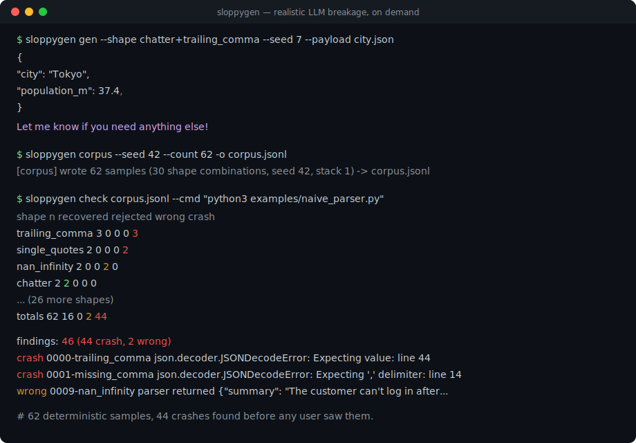
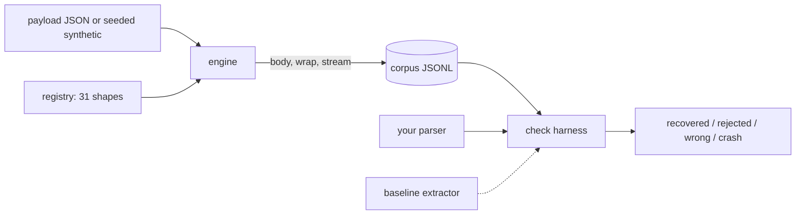

# sloppygen

[English](README.md) | [中文](README.zh.md) | [日本語](README.ja.md)

[](LICENSE) [](CHANGELOG.md) [](pyproject.toml)  [](CONTRIBUTING.md)

**Open-source seeded generator of malformed LLM output — broken JSON, stray fences, leaked chain-of-thought — that finds your parser's crashes before your users do.**



```bash
git clone https://github.com/JaydenCJ/sloppygen && cd sloppygen && pip install -e .
```

> **Pre-release:** sloppygen is not yet published to PyPI. Until the first release, clone [JaydenCJ/sloppygen](https://github.com/JaydenCJ/sloppygen) and run `pip install -e .` from the repository root. The package has zero runtime dependencies, so `PYTHONPATH=src` works too.

## Why sloppygen?

Every LLM app has the same load-bearing component: a parser that turns model output into data. And every one of them was written against output the model produced on a good day. Then production happens — a fence with no closing fence, `'single quotes'`, a leaked `<thinking>` block, a completion cut mid-string — and the parser crashes, or worse, silently ships wrong data. Grammar fuzzers throw random bytes that look nothing like what models emit; hand-written fixtures only cover the failures that already burned you. sloppygen ships 31 documented LLM failure shapes as a deterministic, offline corpus: same seed, same bytes, on any machine — so this week's weirdest completion becomes next week's regression test. It calls no model and needs no API key.

|  | sloppygen | Hypothesis | Atheris | hand-written fixtures |
|---|---|---|---|---|
| Emulates documented LLM failure shapes | Yes (31 shapes) | No (type-driven random) | No (coverage-guided bytes) | Only the ones that already burned you |
| Deterministic corpus from a seed | Yes, byte-identical | Replay via example DB | Corpus-dependent | Yes |
| Ships the expected payload with every sample | Yes | n/a | No | Maintained by hand |
| Catches wrong answers, not just crashes | Yes (crash/wrong/reject triage) | Your assertions | No | Your assertions |
| Needs instrumentation or an LLM | No | No | Native instrumentation | You, pasting from prod logs |
| Runtime dependencies | 0 | 3 | C extension | 0 |

<sub>Dependency counts are the declared runtime requirements on PyPI as of 2026-07: Hypothesis 6.x (attrs, sortedcontainers, plus exceptiongroup on older Pythons). sloppygen's count is `dependencies = []` in [pyproject.toml](pyproject.toml).</sub>

## Features

- **31 documented failure shapes** — fences, chatter, single quotes, Python literals, trailing commas, NaN, truncation mid-string, repetition loops, leaked `<|im_end|>`, zero-width characters, and more; each with an honest one-line provenance note (`sloppygen explain <shape>`).
- **Fully seeded, fully offline** — every sample is keyed by SHA-256 over `(seed, index, shapes)`; a corpus is byte-identical across runs and platforms, and any failing sample regenerates from its one-line metadata record. No model, no API key, no network code at all.
- **Token-aware corruption** — body mutations go through a real JSON tokenizer, so a re-quoted string is exactly a string token and a dropped comma is exactly a structural comma; every sample tests the defect it claims to test.
- **Recoverable vs unrecoverable, tracked honestly** — wrapper noise must be survivable; a mid-string truncation must be rejected cleanly. The flag on every sample separates "extract this" tests from "fail gracefully" tests.
- **A harness that judges outcomes** — `sloppygen check` triages every sample into recovered / rejected / wrong / crash, treats silent wrong answers as findings, and exits 1 for CI. Works with any subprocess (stdin/stdout contract) or any Python callable.
- **Shape stacking** — `--stack 2` composes a body mutation with wrapper prose or stream damage in realistic order, because real failures arrive in combination.
- **A built-in baseline to beat** — `check --baseline` benchmarks the extractor you would have written anyway, including its pinned known flaw (Python's `json.loads` happily accepts `NaN`).

## Quickstart

Install:

```bash
git clone https://github.com/JaydenCJ/sloppygen && cd sloppygen && pip install -e .
```

Corrupt one payload the way a chatty model would — fully deterministic, seed 7 always yields exactly this:

```bash
echo '{"city": "Tokyo", "population_m": 37.4}' > city.json
sloppygen gen --shape chatter+trailing_comma --seed 7 --payload city.json
```

```text
{
  "city": "Tokyo",
  "population_m": 37.4,
}

Let me know if you need anything else!
```

Now the real workflow: build a 62-sample corpus and run a parser against it. Here is what happens when a deliberately naive extractor (split on fences, slice `{`…`}`, `json.loads` — admit it, you have shipped this) meets the catalog. Output is real; elided rows are marked `...`:

```bash
sloppygen corpus --seed 42 --count 62 -o corpus.jsonl
sloppygen check corpus.jsonl --cmd "python3 examples/naive_parser.py"
```

```text
shape                  n  recovered  rejected  wrong  crash
trailing_comma         3          0         0      0      3
missing_comma          3          0         0      0      3
single_quotes          2          0         0      0      2
...
nan_infinity           2          0         0      2      0
...
chatter                2          2         0      0      0
...
totals                62         16         0      2     44

findings: 46 (44 crash, 2 wrong)
  crash  0000-trailing_comma  json.decoder.JSONDecodeError: Expecting value: line 44 column 3 (char 1017)
  crash  0001-missing_comma  json.decoder.JSONDecodeError: Expecting ',' delimiter: line 14 column 7 (char 369)
  ...
```

44 crashes and 2 silently wrong answers, each regenerable from its id. The same harness drives any Python callable — drop this into pytest and the whole catalog becomes a permanent regression suite:

```python
import sloppygen

samples = sloppygen.corpus(sloppygen.synthetic_payload(seed=7), count=62, seed=7)
report = sloppygen.evaluate(samples, my_parser)   # raise ValueError = clean reject
assert not report.findings(), report.render()
```

A copy-paste pytest version lives in [`examples/pytest_regression.py`](examples/pytest_regression.py), and the full catalog reference in [`docs/shapes.md`](docs/shapes.md).

## The shape catalog

31 shapes across four categories; `sloppygen list` prints the full table and `sloppygen explain <id>` shows a live before/after demo with a provenance note.

| Category | Shapes | Examples |
|---|---|---|
| `wrapper` | 9 | markdown fences (closed, unclosed, stuttered, mislabeled), chatter, XML-ish tags, leaked thinking blocks |
| `syntax` | 12 | trailing/missing commas, single quotes, unquoted keys, Python literals, smart quotes, comments, raw newlines, NaN, nonstandard numbers, full-width punctuation |
| `structure` | 8 | ellipsis placeholders, JSONL spray, double-encoded JSON, duplicated output, self-correction, unbalanced closers, two flavors of truncation |
| `noise` | 2 | HTML entities, zero-width characters and BOM |

Corpus generation is controlled by a handful of options:

| Key | Default | Effect |
|---|---|---|
| `--seed` | `42` | keys every random decision; same seed, same bytes |
| `--count` | `64` | samples to emit; shapes cycle in registry order before repeating |
| `--payload` | synthetic | JSON file (or `-` for stdin) to corrupt; the default synthetic payload enables every shape except the array-only `jsonl_spray` |
| `--stack` | `1` | shapes per sample: 2 = body + wrap/stream, 3 = body + wrap + stream |
| `--shapes` / `--category` | all | restrict the catalog |

## Exit codes and the check contract

Subprocess parsers receive the sample on stdin and answer with JSON on stdout (exit 0), or exit 1 cleanly to reject; tracebacks, exit codes ≥ 2, timeouts, and non-JSON stdout count as crashes. In-process parsers raise `ValueError` to reject; anything else is a crash. Wrong answers are always findings; clean rejections only count under `--strict`, and only for recoverable samples. Full contract in [`docs/corpus-format.md`](docs/corpus-format.md).

## Verification

This repository ships no CI; every claim above is verified by local runs. Reproduce them from a checkout of this repository:

```bash
pip install -e '.[dev]' && pytest && bash scripts/smoke.sh
```

Output (copied from a real run, truncated with `...`):

```text
90 passed in 0.46s
...
[naive] findings: 46 (44 crash, 2 wrong)
SMOKE OK
```

## Architecture



## Roadmap

- [x] 31-shape catalog, token-aware engine, seeded corpus, stacking, check harness, baseline extractor, CLI (v0.1.0)
- [ ] PyPI release with `pip install sloppygen`
- [ ] Semantic-drift shapes (key-case drift, unit swaps) with adjusted expected payloads
- [ ] Streaming corpus mode: emit samples as chunk sequences for incremental parsers
- [ ] Schema-aware synthetic payloads generated from a user-supplied JSON Schema

See the [open issues](https://github.com/JaydenCJ/sloppygen/issues) for the full list.

## Contributing

Contributions are welcome — start with a [good first issue](https://github.com/JaydenCJ/sloppygen/issues?q=is%3Aissue+is%3Aopen+label%3A%22good+first+issue%22) or open a [discussion](https://github.com/JaydenCJ/sloppygen/discussions). See [CONTRIBUTING.md](CONTRIBUTING.md) for the development setup.

## License

[MIT](LICENSE)
