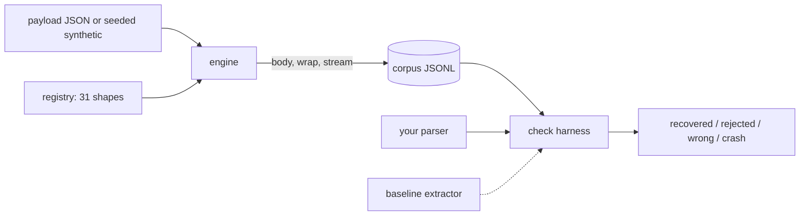

# sloppygen

[English](README.md) | [中文](README.zh.md) | [日本語](README.ja.md)

[](LICENSE) [](CHANGELOG.md) [](pyproject.toml)  [](CONTRIBUTING.md)

**开源的 LLM 畸形输出种子化生成器——残破的 JSON、游离的代码围栏、泄漏的思维链——在用户之前先找到你的解析器崩溃点。**


```bash
git clone https://github.com/JaydenCJ/sloppygen && cd sloppygen && pip install -e .
```

> **预发布：** sloppygen 尚未发布到 PyPI。在首个正式版之前，请克隆 [JaydenCJ/sloppygen](https://github.com/JaydenCJ/sloppygen) 并在仓库根目录执行 `pip install -e .`。本包零运行时依赖，直接 `PYTHONPATH=src` 也可以。

## 为什么选择 sloppygen？

每个 LLM 应用都有同一个承重组件：把模型输出变成数据的解析器。而它们全都是对着模型"状态好的那天"的输出写出来的。然后生产环境来了——没有闭合的围栏、`'单引号'`、泄漏的 `<thinking>` 块、在字符串中间被截断的补全——解析器崩溃，或者更糟：悄悄输出错误数据。语法模糊测试器抛出的随机字节和模型的真实输出毫无相似之处；手写的用例只覆盖已经坑过你的那些失败。sloppygen 把 31 种有据可查的 LLM 失败形态做成确定性的离线语料：同一个种子，在任何机器上都是同样的字节——本周最诡异的补全就成了下周的回归测试。它不调用任何模型，也不需要 API key。

|  | sloppygen | Hypothesis | Atheris | 手写用例 |
|---|---|---|---|---|
| 模拟有据可查的 LLM 失败形态 | 是（31 种） | 否（类型驱动随机） | 否（覆盖率导向的字节） | 只有已经坑过你的那些 |
| 由种子生成确定性语料 | 是，字节级一致 | 通过示例库回放 | 依赖语料库 | 是 |
| 每个样本自带期望负载 | 是 | 不适用 | 否 | 手工维护 |
| 抓出错误答案，而不只是崩溃 | 是（crash/wrong/reject 三分） | 你自己写断言 | 否 | 你自己写断言 |
| 需要插桩或 LLM | 否 | 否 | 原生插桩 | 你，从生产日志里粘贴 |
| 运行时依赖 | 0 | 3 | C 扩展 | 0 |

<sub>依赖数量为 2026-07 时 PyPI 上声明的运行时依赖：Hypothesis 6.x（attrs、sortedcontainers，旧版 Python 另加 exceptiongroup）。sloppygen 的数量即 [pyproject.toml](pyproject.toml) 中的 `dependencies = []`。</sub>

## 特性

- **31 种有据可查的失败形态**——围栏、寒暄、单引号、Python 字面量、尾随逗号、NaN、字符串中途截断、重复循环、泄漏的 `<|im_end|>`、零宽字符等等；每种都附一句诚实的成因说明（`sloppygen explain <shape>`）。
- **完全种子化，完全离线**——每个样本由 `(seed, index, shapes)` 的 SHA-256 派生；语料在任何平台、任何运行间都字节级一致，任何失败样本都能从一行元数据记录精确重生成。没有模型、没有 API key、完全没有网络代码。
- **词法级精准破坏**——body 层变异经过真正的 JSON 分词器，被换引号的一定是字符串 token，被删掉的一定是结构逗号；每个样本测的就是它声称要测的缺陷。
- **可恢复与不可恢复，诚实标注**——包装噪音必须能被解析穿透；字符串中途截断则必须被干净拒绝。每个样本上的标志把"必须提取出来"和"必须优雅失败"两类测试分开。
- **裁决结果的测试台**——`sloppygen check` 把每个样本分诊为 recovered / rejected / wrong / crash，把静默的错误答案视为问题，并以退出码 1 对接 CI。支持任意子进程（stdin/stdout 契约）或任意 Python 可调用对象。
- **形态叠加**——`--stack 2` 按真实顺序把 body 变异与包装寒暄或流损坏组合起来，因为真实的失败总是成群结队。
- **自带一个待超越的基线**——`check --baseline` 对标那个你反正也会写出来的提取器，包括它被钉死的已知缺陷（Python 的 `json.loads` 会欣然接受 `NaN`）。

## 快速上手

安装：

```bash
git clone https://github.com/JaydenCJ/sloppygen && cd sloppygen && pip install -e .
```

像一个话痨模型那样破坏一个负载——完全确定性，种子 7 永远产出下面这个：

```bash
echo '{"city": "Tokyo", "population_m": 37.4}' > city.json
sloppygen gen --shape chatter+trailing_comma --seed 7 --payload city.json
```

```text
{
  "city": "Tokyo",
  "population_m": 37.4,
}

Let me know if you need anything else!
```

接着是真正的工作流：生成 62 个样本的语料，拿一个解析器去跑。下面是一个故意写得很天真的提取器（按围栏切分、截取 `{`…`}`、`json.loads`——承认吧，你上线过这种代码）撞上整个目录的结果。输出为真实运行，省略的行以 `...` 标出：

```bash
sloppygen corpus --seed 42 --count 62 -o corpus.jsonl
sloppygen check corpus.jsonl --cmd "python3 examples/naive_parser.py"
```

```text
shape                  n  recovered  rejected  wrong  crash
trailing_comma         3          0         0      0      3
missing_comma          3          0         0      0      3
single_quotes          2          0         0      0      2
...
nan_infinity           2          0         0      2      0
...
chatter                2          2         0      0      0
...
totals                62         16         0      2     44

findings: 46 (44 crash, 2 wrong)
  crash  0000-trailing_comma  json.decoder.JSONDecodeError: Expecting value: line 44 column 3 (char 1017)
  crash  0001-missing_comma  json.decoder.JSONDecodeError: Expecting ',' delimiter: line 14 column 7 (char 369)
  ...
```

44 次崩溃和 2 个静默错误答案，每一个都能凭 id 重生成。同一个测试台也能驱动任意 Python 可调用对象——放进 pytest，整个目录就成了永久回归套件：

```python
import sloppygen

samples = sloppygen.corpus(sloppygen.synthetic_payload(seed=7), count=62, seed=7)
report = sloppygen.evaluate(samples, my_parser)   # raise ValueError = clean reject
assert not report.findings(), report.render()
```

可直接复制的 pytest 版本在 [`examples/pytest_regression.py`](examples/pytest_regression.py)，完整目录参考在 [`docs/shapes.md`](docs/shapes.md)。

## 形态目录

四大类共 31 种形态；`sloppygen list` 打印完整表格，`sloppygen explain <id>` 展示带成因说明的实时前后对比。

| 类别 | 数量 | 示例 |
|---|---|---|
| `wrapper` | 9 | markdown 围栏（闭合、未闭合、口吃、贴错标签）、寒暄、XML 风格标签、泄漏的思考块 |
| `syntax` | 12 | 尾随/缺失逗号、单引号、无引号键、Python 字面量、弯引号、注释、裸换行、NaN、非标准数字、全角标点 |
| `structure` | 8 | 省略号占位符、JSONL 喷洒、双重编码 JSON、输出重复、自我纠正、括号不闭合、两种截断 |
| `noise` | 2 | HTML 实体、零宽字符与 BOM |

语料生成由几个选项控制：

| 键 | 默认值 | 作用 |
|---|---|---|
| `--seed` | `42` | 决定每一次随机选择；同种子，同字节 |
| `--count` | `64` | 产出的样本数；形态按注册顺序轮转后才重复 |
| `--payload` | 合成 | 要破坏的 JSON 文件（`-` 表示 stdin）；默认合成负载能启用除仅限数组的 `jsonl_spray` 之外的全部形态 |
| `--stack` | `1` | 每个样本的形态数：2 = body + wrap/stream，3 = body + wrap + stream |
| `--shapes` / `--category` | 全部 | 收窄目录范围 |

## 退出码与 check 契约

子进程解析器从 stdin 读入样本，向 stdout 输出 JSON（退出码 0），或干净地以退出码 1 拒绝；traceback、退出码 ≥ 2、超时、非 JSON 的 stdout 均计为崩溃。进程内解析器抛 `ValueError` 表示拒绝；其他异常都是崩溃。错误答案永远是问题；干净的拒绝仅在 `--strict` 下、且仅对可恢复样本计为问题。完整契约见 [`docs/corpus-format.md`](docs/corpus-format.md)。

## 验证

本仓库不带任何 CI；上文的每一条断言都由本地运行验证。在本仓库的检出目录中复现：

```bash
pip install -e '.[dev]' && pytest && bash scripts/smoke.sh
```

输出（摘自真实运行，以 `...` 截断）：

```text
90 passed in 0.46s
...
[naive] findings: 46 (44 crash, 2 wrong)
SMOKE OK
```

## 架构



## 路线图

- [x] 31 种形态目录、词法级引擎、种子化语料、形态叠加、check 测试台、基线提取器、CLI（v0.1.0）
- [ ] 发布到 PyPI，支持 `pip install sloppygen`
- [ ] 语义漂移形态（键名大小写漂移、单位互换），并相应调整期望负载
- [ ] 流式语料模式：把样本拆成分块序列，供增量解析器使用
- [ ] 依据用户提供的 JSON Schema 生成模式感知的合成负载

完整列表见 [open issues](https://github.com/JaydenCJ/sloppygen/issues)。

## 参与贡献

欢迎贡献——从一个 [good first issue](https://github.com/JaydenCJ/sloppygen/issues?q=is%3Aissue+is%3Aopen+label%3A%22good+first+issue%22) 开始，或发起一场 [discussion](https://github.com/JaydenCJ/sloppygen/discussions)。开发环境搭建见 [CONTRIBUTING.md](CONTRIBUTING.md)。

## 许可证

[MIT](LICENSE)
